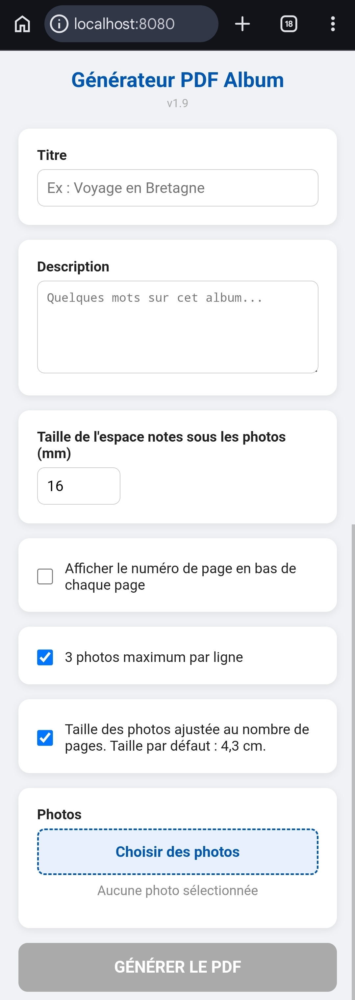

# Générateur.galerie

Un générateur d'albums photo en PDF, accessible depuis un navigateur web, conçu pour fonctionner aussi bien sur **Android (via Termux)** que sur **Windows**.

---

## Fonctionnalités

- Interface web locale accessible depuis le navigateur du téléphone ou du PC
- Mise en page automatique des photos en grille proportionnelle
- Optimisation automatique de la taille des photos pour remplir les pages
- Espace sous chaque ligne pour écrire des légendes à la main après impression
- Glisser-déposer pour réordonner les photos avant génération
- Support des formats JPG, PNG, BMP et HEIC (photos iPhone)
- Emojis dans le titre et la description (police Noto Emoji)
- Numérotation optionnelle des pages
- Téléchargement direct du PDF dans le navigateur
- Compatible Android (Termux et Termux:Widget) et Windows

---

## Capture d'écran

.

---

## Installation

### Prérequis

- Python 3.10 ou supérieur
- pip

### Dépendances Python

```bash
pip install flask fpdf2 pillow pillow-heif
```

> **Note :** Utilisez bien `fpdf2` et non `fpdf` — ce sont deux paquets différents.

> **Note :** `pillow-heif` nécessite la bibliothèque système `libheif`. Si l'installation échoue, voir la section ci-dessous.

---

## Installation sur Android (Termux)

### 1. Installer Termux

Téléchargez Termux depuis [F-Droid](https://f-droid.org/packages/com.termux/) (recommandé).

### 2. Installer les dépendances système

```bash
pkg update && pkg upgrade
pkg install python libheif fonts-dejavu
```

### 3. Installer les dépendances Python

```bash
pip install flask fpdf2 pillow pillow-heif
```

### 4. Télécharger le script

```bash
mkdir -p ~/generateur-galerie
cd ~/generateur-galerie
# Copier generateur.galerie.py dans ce dossier
```

### 5. Lancer

```bash
python ~/generateur-galerie/generateur.galerie.py
```

Puis ouvrir **`http://localhost:8080`** dans le navigateur du téléphone.

---

### Raccourci Termux:Widget (optionnel)

Installez [Termux:Widget](https://f-droid.org/packages/com.termux.widget/) depuis F-Droid, puis créez le raccourci :

```bash
mkdir -p ~/.shortcuts
cat > ~/.shortcuts/Album_PDF.sh << 'EOF'
#!/data/data/com.termux/files/usr/bin/bash
if nc -z localhost 8080 2>/dev/null; then
    am start -a android.intent.action.VIEW -d "http://localhost:8080"
else
    python ~/generateur-galerie/generateur.galerie.py &
    sleep 2
    am start -a android.intent.action.VIEW -d "http://localhost:8080"
fi
EOF
chmod +x ~/.shortcuts/Album_PDF.sh
```

Accordez ensuite à Termux la permission **"Afficher par-dessus les autres applications"** dans les paramètres Android (Paramètres → Applications → Termux → Avancé).

---

## Installation sur Windows

### 1. Installer Python

Téléchargez Python depuis [python.org](https://www.python.org/downloads/). Cochez **"Add Python to PATH"** lors de l'installation.

### 2. Installer les dépendances

```bat
py -m pip install flask fpdf2 pillow pillow-heif
```

### 3. Lancer

```bat
py generateur.galerie.py
```

Le navigateur s'ouvre automatiquement sur `http://localhost:8080`.

---

## Utilisation

1. Saisissez un **titre** et optionnellement une **description**
2. Réglez la **taille de l'espace notes** sous les photos (en mm) — cet espace est prévu pour écrire des légendes à la main après impression
3. Choisissez vos **options de mise en page** :
   - *3 photos maximum par ligne* : limite le nombre de colonnes
   - *Taille ajustée* : optimise automatiquement la hauteur des photos pour remplir les pages au maximum
4. Sélectionnez vos **photos** (JPG, PNG, HEIC...)
5. Réordonnez-les si besoin par **glisser-déposer**
6. Cliquez sur **GÉNÉRER LE PDF**
7. Le PDF se télécharge automatiquement dans le navigateur

---

## Polices

Le script télécharge automatiquement au premier lancement :

- **DejaVuSans.ttf** — pour le texte (titre, description)
- **NotoEmoji-Regular.ttf** — pour les emojis dans le titre et la description

Sur Windows, les polices sont installées automatiquement pour l'utilisateur courant (sans droits administrateur).

Sur Android/Termux, `pkg install fonts-dejavu` installe DejaVu. Noto Emoji est téléchargé automatiquement.

---

## Dépendances

| Paquet | Rôle |
|---|---|
| `flask` | Serveur web local |
| `fpdf2` | Génération du PDF |
| `pillow` | Traitement des images |
| `pillow-heif` | Support du format HEIC (photos iPhone) |

---

## Licence

MIT — libre d'utilisation, de modification et de redistribution.
